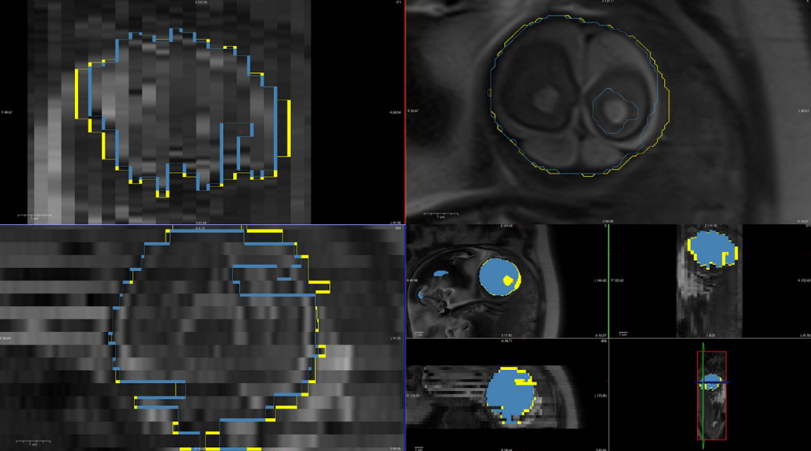
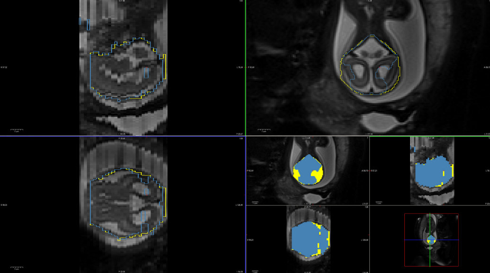

# Automatic Brain Masking

## Description

Deep learning based project made to automatically mask fetal brains.

### About this model

This model was trained with a dataset comprising of ~700 reviewed stacks of images and masks, adding to a total of ~20,000 images. 
It has a wider range of data to improve its robustness. For the sake of identifying this model against priors, its called `emerald`.

Here are some images showcasing its performance against the previous model, where the $\textcolor{NavyBlue}{\text{blue}}$ mask corresponds to the $\textcolor{NavyBlue}{\text{old}}$ model and the $\textcolor{yellow}{\text{yellow}}$ mask to $\textcolor{yellow}{\text{emeralds}}$.







## Usage

`pl-emerald` is available as a _ChRIS_ plugin. You can either run it using the _ChRIS_ cloud GUI
or locally on the command line. To use it locally, move input NIFTI files to a directory and then run

```shell
apptainer run docker://ghcr.io/fnndsc/pl-emerald:latest emerald input/ output/
```

To create masks next to the original file, with the names `*_mask.nii`:

```shell
apptainer run docker://ghcr.io/fnndsc/pl-emerald:latest emerald --mask-suffix _mask.nii input/ input/
```

To extract brains without keeping the mask file:

```shell
apptainer run docker://ghcr.io/fnndsc/pl-emerald:latest emerald --mask-suffix '' --outputs '0:.nii' input/ output/
```

To create output masks, extracted brains, and masks overlayed on the original with dimmed background (for convenient visualization):

```shell
apptainer run docker://ghcr.io/fnndsc/pl-emerald:latest emerald --mask-suffix '_mask.nii' --outputs '0.0:_brain.nii,0.2:_overlay02.nii' input/ output/
```

## Limitations

- Unet can currently only work with 256x256 images

## CPU v.s. GPU performance

Quick notes about CPU v.s. GPU performance.
To process 5 input files takes ~17s on CPU, ~6s on GPU.
This includes the boot time of the program (loading models) however it does not include
the time it takes to pull and/or process the container image.
The TensorFlow base image is 437.67 MB in size, or 2.67 GB in size with Nvidia drivers.
